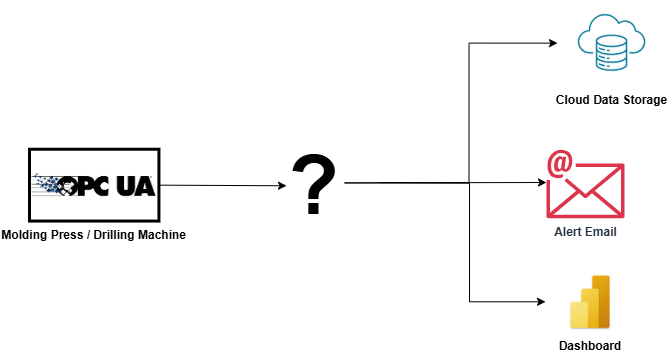
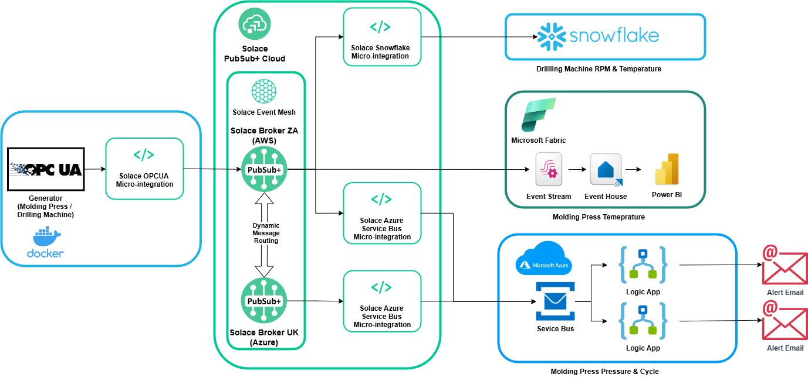
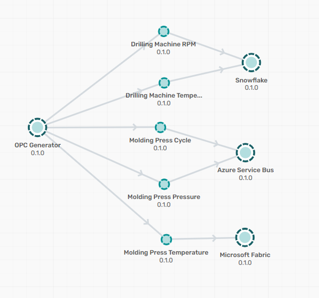
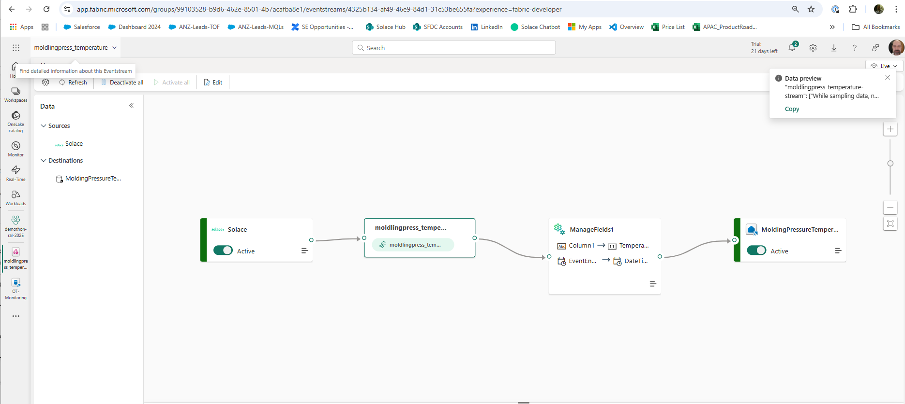

# OT-to-cloud

## What 

## Overview

## Topic Taxonomy
### Molding Press Events
demothonco/opcua/shopfloor/moldingPress/measured/pressure
demothonco/opcua/shopfloor/moldingPress/measured/temperature 
demothonco/opcua/shopfloor/moldingPress/measured/cycle

### Drill Machine Events
demothonco/opcua/shopfloor/drillingMachine/measured/rpm
demothonco/opcua/shopfloor/drillingMachine/measured/temperature

## Event Portal Model

## Setup

### Snowflake
Request a Snowflake account through IT.

### Azure  
Use Azure-Template-demothon-ral-2025.zip to create the Azure artefects.

### Solace Cloud
Create two cloud brokers and mesh them.  
Create the queues & subscriptions.
Create the cloud micro-integrations for Snowflake & Azure.

### OPCUA 
Use docker compose to install the OPCUA generator and micro-integration.

### Fabric
For Fabric sign up for a demo account (30 days) create the event stream.

